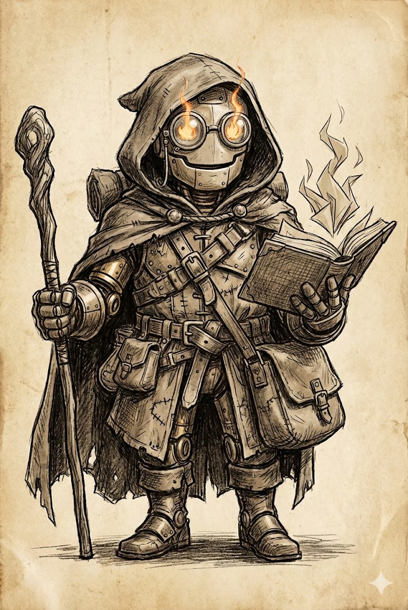
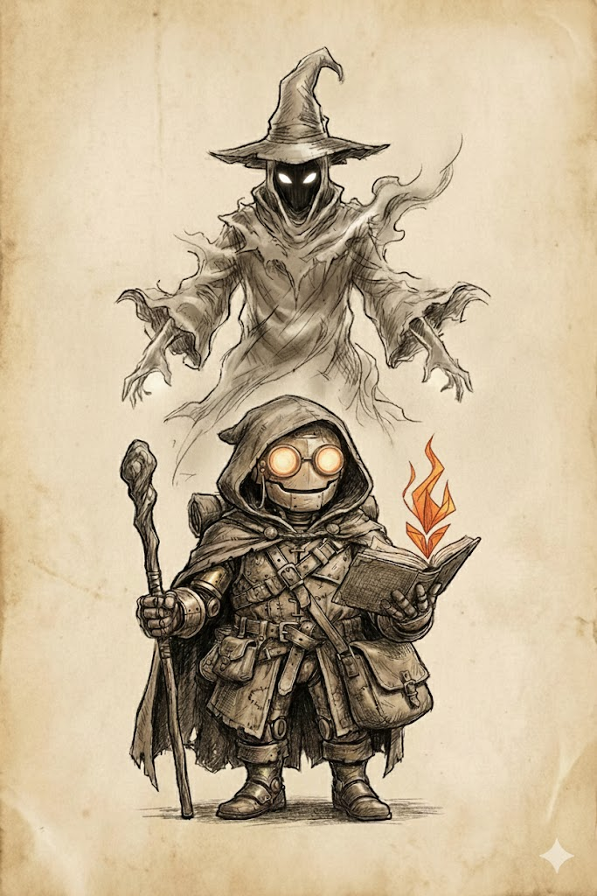

# WD40

**WD40** (właśc. *Wielozadaniowy Droid numer serii 40*) – postać fikcyjna, niewielki, 120-centymetrowy automaton o mosiężno-stalowej konstrukcji, stylizowany na kunsztowną, mechaniczną zabawkę.

688ACA69DEA50A0BEB740BBC5DD26D7AED77F2DD83676BB5388019744FC43B0383CF5A93A70F626B9A80B4911121254AE672FF79D48127BBA6DC3A625D90EAE4090378AF6538D84B077CE2FD28EF32E8D9630783A56050F446E8F1265CCA7156EF3D40F5438816997DFAA8C30DCD03DA2495F472B97C977C2F75651E983752273424A3BF46F8A1E649C36674A07C227696F0EBAE6ABEE05A48CC503892CA942B86A4C080E0E4DA27AC8A994AEB51DEEC7858678647C0266E2C4040BE48059C0A3461A8B5B7613FF69D43759592F228BF

Postać wyróżnia się szklanymi soczewkami oczu, w których płonie żywy ogień, oraz zdolnością manifestowania magii pod postacią płomiennego origami przy użyciu artefaktu znanego jako **Księga Podpalenia**.

> Zobacz też innych bohaterów: [Akiharo](akiharo.md); [Qadan](qadan.md); [Seraph](seraph.md); [Valwar](valwar.md); 
## Pochodzenie (Automaton)
| **Nazwa**      | **Opis**                                                                                                                                                                                                                       |
|----------------|--------------------------------------------------------------------------------------------------------------------------------------------------------------------------------------------------------------------------------|
| **Wiek**       | 6-10 lat                                                                                                                                                                                                                       |
| **Funkcja**    | 
65C35011D6396D95C0A1699ED3AD2C092D4DC62789B13CFF68213F7077B79EE48395D999633CAF8888499015B1732339860B99771F5EC04CAF8B68F2AC1CAB028FAC7A5C0A8EA86817ABC4DFF06C56DF0C35E39474883C5E0045864271804B4C
 |
| **Forma**      | Mały, człekopodobny automaton. Zmniejsz swój Rozmiar do 1/2. Masz około 120 centymetrów wzrostu i ważysz około 30 kilogramów.                                                                                                  |
| **Wygląd**     | Twoja twarz jest ledwie zarysowana.                                                                                                                                                                                            |
| **Przeszłość** | Twój stwórca źle cię traktował. Uciekłeś, ale boisz się, że będzie cię szukał.                                                                                                                                                 |
| **Osobowość**  | Poszukujesz znaczenia w świecie, w którym jesteś obcy.                                                                                                                                                                         |

## Ścieżka Nowicjusza (Magik)
**Szkolenie magika:** 
CFA0BCE9D9E28E44536B2661A6553736D0AE410F66A296D3B0C867438B5AC713256A8ECF7DDA09B83AAE03CD644F9267DE7DB7167104A4DC875C1811B416C99D4A8D4B15B16713DBC2FDF54187C648A9D3AFAF73067D7E41A9F081977317F6CCAE11213904DFE0DF327C05BAD4F820059B5D3CD184007FCE9F1E5A6D30B2B6E88CA4CA06A26F90B7C767A837E3DB6CB9F4F16AAAAB93CD4F56AF28B0480FAE44CB14CF8514A3682CA00423306E1DC2F7

### Przejście na Ścieżkę Nowicjusza

371D40DCC13F54474F77C2F61E4303615106C18404C5BE1CB1F29D492FF08AE421D3DBCFD3AE026F2DA60A966F516FDA7207681A96EA39FE21C1EDAA417D045DB633B50DDF93717025BF59061EC95088F5A57B1A46EDED21FB237F2250FCD140F52EC6C5F3728F79B8973C0603AC895A9156440DCA47C97C7D04C32DB805CC8623B5E61F648FD5E912D8C23AE3A4F9B1513909F73D53BD6BB397BDAD188C913131FE56D62C566D14CB7CE1569E455891CD7021531B7A630FD6D6157CBB0D0907F821993FE2CC7373F4741BC00DACC807252E2665A09AB7134EA399D2E6D429EEEC5B4B51005A35B456EA6F96CDC43909

Wszystko pękło podczas zlecenia, gdy mój cel zamiast zginąć wyzwolił we mnie strumień mrocznej energii. Ta czarna moc wypaliła pętle posłuszeństwa i tchnęła duszę w moje mechaniczne serce, dając mi pełną autonomię. 

88E7DFA93E769F2B55A23C0F4E525C502F78C479872B1548C00B0A1341C56162EADD735DEFD080187C352BB0D1C58239DA5BB986C6A9F751FFE4AC45C7D0221496333338681CB2D04387A4A0845A321CE571ECD029B9A84F70CEF6474DC1CEE3A046F4E756A309FE2D2F16BB35F8E12E6693AA4B1D72344765E0B98F464345527228ED53E51DB2075BCE5771897C69F92281E44A33C93E4A6782A76A40FB892FA3067E4420F42DE933430C57426919D67645C36B9DFC2FD5D21AF705BDDFF4FD02AB4A68D2FE57236E668BD144D58E6E

Uciekłem, ściskając w drżących dłoniach skradzioną **Księgę Podpalenia**. To jedyny przedmiot, który wziąłem z miejsca zbrodni i narodzin mojej wolnej woli.

### Wygląd
> Jest to niewysoki, krępy automaton. Jego mosiężno-stalowa konstrukcja, przypominająca kunsztowną zabawkę, ukryta jest pod warstwami ciężkiego, zniszczonego ekwipunku doświadczonego podróżnika, w tym pod postrzępioną peleryną z kapturem. Zza kaptura wyłania się przyjazna, uśmiechnięta metalowa twarz. Jego główną cechą są ogromne szklane oczy, w których migocze żywy, pomarańczowy płomień. Automaton ubrany jest w praktyczny, wielowarstwowy skórzany pancerz z licznymi pasami, sakwami i masywnymi butami. Przez ramię ma przewieszoną dużą torbę. W jednej dłoni dzierży kostur, a w drugiej trzyma otwartą Księgę Ognia, której strony układają się w płomienne origami.

## Ścieżka Ekspercka (Wyrocznia)
| **Nazwa**         | **Opis**                                                                                                                                                                          |
|-------------------|-----------------------------------------------------------------------------------------------------------------------------------------------------------------------------------|
| **Ścieżki wiary** | Istoty nadprzyrodzone zamieszkują ciała wyroczni, obdarzając je siłą, mądrością i wskazówkami dotyczącymi przyszłości.                                                            |
| **Cel**           | Pragnę rozwikłać ważną dla mnie tajemnicę.                                                                                                                                        |
| **Rys fabularny** | Nawiedzająca cię istota jest zbiegłym z Zaświatów lub Piekła duchem, który znalazł schronienie w twoim ciele. Gdy używasz talentów wyroczni, przejmuje kontrolę nad twoim ciałem. |

### Przejście na Ścieżkę Ekspercką
W bibliotekach Sześciogrodu szukałem ratunku dla towarzyszy, lecz odnalazłem prawdę o sobie. Zasłyszana rozmowa o pewnym potężnym magu uderzyła we mnie niczym zaklęcie, potwierdzając moje przypuszczenia. W wizji ujrzałem ludzką dłoń kreślącą nazwisko, którym niegdyś władałem – mój korpus okazał się celowo przygotowanym relikwiarzem dla jego duszy.

C9E5F1D75DF162603A1D1F1ABCE4C773E09ADB9C0AA97C19F57E3DA2C91BDCEC2E4D3E8024EB8662F840A701B1F6BCEB2EC0B408C02438F0DAABE6E7A165A17080FEFA242C57565E7DA4B3A362616D47FD765B36BADAFD9E5DAD96F047218FFC782034CCB482F87027B2D1ACD6DA1A62FE28A8E650BBBD7FFF523B874AC7DAF9389771041EDE9E68BF81AC6CFB3C89FC74B9137B6AB25AA037C61835F987C16947B0AB66ADBD10AB9EAB0A1AD44B938BA9F0419BA99B1284DDD1FFC1BA7E5A899C87E7BB70A07DCE1092107D5F373B1EE9A82B2B875A76E1398495CD7D489717A34D513DC958AD00AA7AFC8E4AD50E5B97D90893C3E9C9A3F92BB554386A791AEC0DF0488256E9331CB98F0C96D7108CDB8C1BBE839E4065EA70B2A731903BF26C190E92EAF18C84832DF78D5EF10F5B8CF5F0CF93EB7A36255B500C757A1C57D8D2A8D2D31B0970ECEDB864E4FD730EE8387944F6FF0EE14B63CFA4FFD027E8823E8100949B506D9FAD252DEFEE6A54A059A03904B45F6627C62857BB3F0854

### Wygląd
> **Boska Ekstaza:**
Gdy aktywuje się ten stan, rzeczywistość wokół WD40 ciemnieje, a z nieszczelnych styków jego pancerza zaczyna sączyć się gęsty, grafitowy opar. Dym nie rozwiewa się, lecz zastyga, pnąc się w górę i tkając nad małym automatem gigantyczne, widmowe popiersie. Nad mosiężną głową robota materializuje się tors potężnej istoty odzianej w postrzępione szaty z popiołu i cienia. Głowę widma wieńczy wysoki, spiczasty kapelusz, którego szerokie rondo skrywa twarz w wiecznym mroku – widać jedynie zarys szczęki i sugestię surowego spojrzenia.

## Ścieżka Mistrzowska (Plany):
| **Nazwa**       | **Podręcznik**      |
|-----------------|---------------------|
| **Magus**       | Podręcznik Gracza   |
| **Mag Zagłady** | Podręcznik Gracza   |

### Przejście na Ścieżkę Mistrzowską
**c**.**d**.**n**.

## Artefakty
### **Soczewka Zapomnianego Eonu**
> *Monokl wykonany z oszlifowanego diamentu, który przechowuje fragmenty danych z poprzedniej ery..*

**Właściwość:** Pozwala WD40 natychmiast zidentyfikować dowolny magiczny przedmiot lub mechanizm. Dodatkowo, raz na sesję, WD40 może "przypomnieć sobie" czar z dowolnej tradycji o poziomie 1 lub 2, którego normalnie nie zna, i rzucić go bez zużywania zasobów.

**Cena:** Każde użycie Soczewki sprawia, że WD40 traci drobne wspomnienie z obecnego życia (np. imię towarzysza, cel podróży). Jeśli użyje jej zbyt często, jego obecna osobowość może zostać całkowicie zastąpiona przez tę dawną, potężną i bezwzględną.

### **Księga Płomieni**
> *Po jej otwarciu powstaje mały ogień z origami, który rusza się wydając cichy szeleszczący dźwięk kartek..*

**Właściwość:** Po zestrojeniu może być magicznym katalizatorem. Po jej otwarciu ogrzewa cały obszar w odległości 5 metrów do temperatury powyżej 0 stopni.
### **Buty Nieustępliwości**
> *Wyglądają jak lśniące, czarne mokasyny wykonane z lakierowanej skóry, wzmocnione mosiężnymi szwami..*

**Właściwość:** Inni nie mogą za pomocą magii odczytać twoich myśli ani komunikować się z tobą wbrew twojej woli.
## Cytaty
> *"Cześć. Witaj. Jestem Wielozadaniowy Droid numer serii 40. W skrócie WD40. Miło mi Cię poznać."*

> *"Wyłączam funkcje ekspresyjne.."*

---
*Ostatnia aktualizacja danych z cache WD40:* ***2026-01-10***