# Pochodzenie
W **Cień Władcy Demonów** wybór pochodzenia determinuje nie tylko statystyki, ale też miejsce twojej postaci w świecie. Poniżej znajdziesz krótki opis każdej z opcji wraz z odnośnikiem do pełnych zasad.

### **[Automaton](pochodzenie/automaton.md)**
Mechaniczne istoty ożywione duszami wyrwanymi z Zaświatów. Nie potrzebują jedzenia ani snu, ale muszą być regularnie nakręcane kluczem, aby funkcjonować jako żywe stworzenia.
 **Cechy:** *Konstrukt, niewrażliwość na trucizny, mechanika klucza.*
 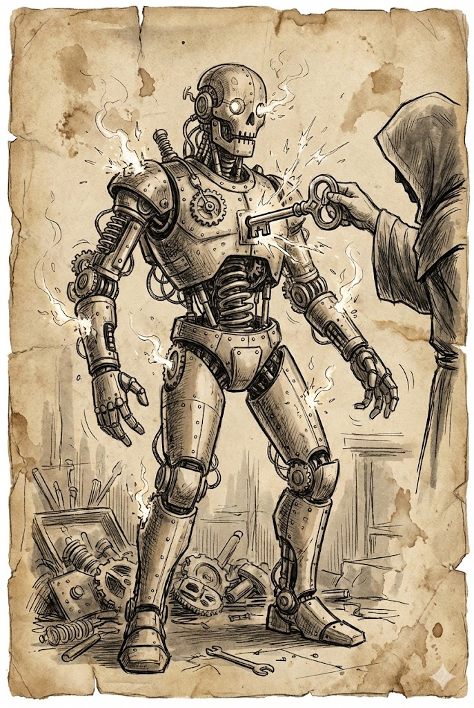

### **[Chochlik](pochodzenie/chochlik.md)**
Maleńkie, kapryśne faerie, które uwielbiają płatać figle. Choć wyglądają niewinnie i uroczo, potrafią być okrutne i nieprzewidywalne.
 **Cechy:** *Rozmiar 1/8, latanie, naturalna niewidzialność, magia iluzji.*
 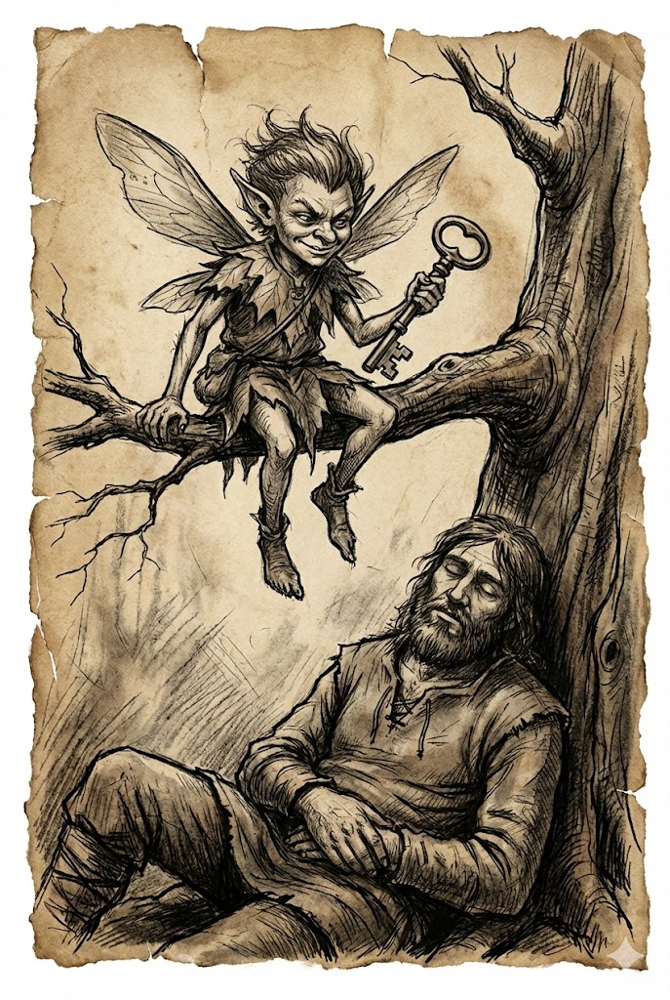

### **[Człowiek](pochodzenie/czlowiek.md)**
Najliczniejsza i najbardziej zróżnicowana populacja na świecie. Ludzie są ambitni, zaradni i tworzą potężne cywilizacje, choć ich natura często prowadzi do konfliktów.
 **Cechy:** *Wszechstronność, determinacja, silna więź społeczna.*
 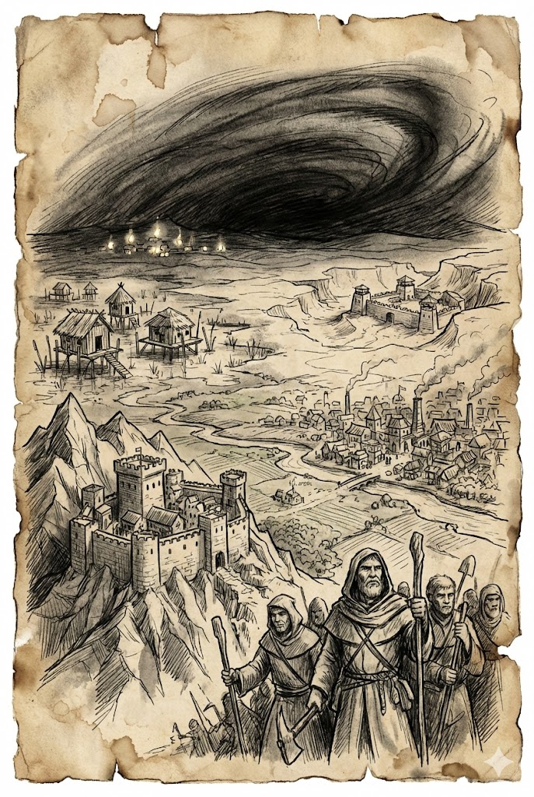

### **[Elf](pochodzenie/elf.md)**
Nieśmiertelni władcy krain fey o uderzającym, strasznym pięknie. Są aroganccy, magicznie uzdolnieni i często gardzą śmiertelnikami.
 **Cechy:** *Nieśmiertelność, ochrona przed magią, charyzmatyczna aura, wrażliwość na żelazo.*
 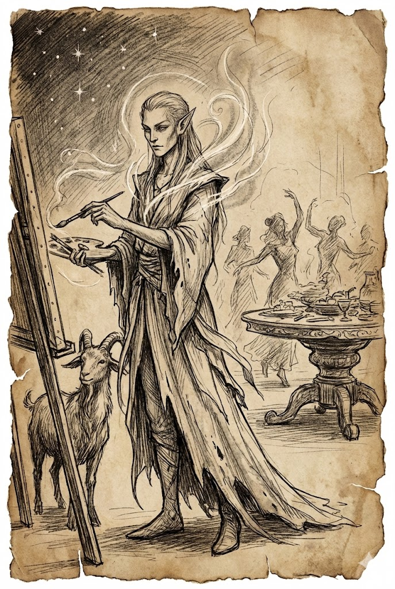

### **[Faun](pochodzenie/faun.md)**
Potomstwo ludzi i faerie, łączące cechy obu ras. Mają kozie nogi i rogi, a ich natura sprawia, że są szybcy, zwinni i trzymają się na uboczu.
 **Cechy:** *Szybkość (Pędziwiatr), widzenie w cieniu, zdolność ucieczki.*
 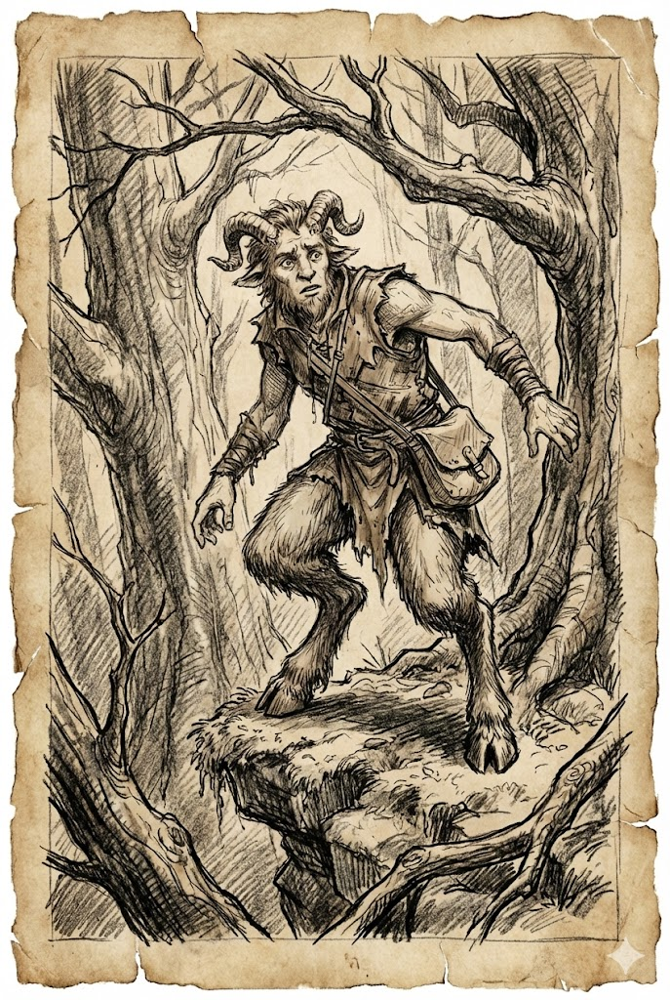

### **[Fomor](pochodzenie/fomor.md)**
Zdegenerowani, koziogłowi zwierzoludzie, stanowiący mięso armatnie w armiach Bestii. Są tchórzliwi, ale niebezpieczni, gdy atakują w stadzie.
 **Cechy:** *Tchórzostwo, walka w stadzie, odporność na choroby.*
 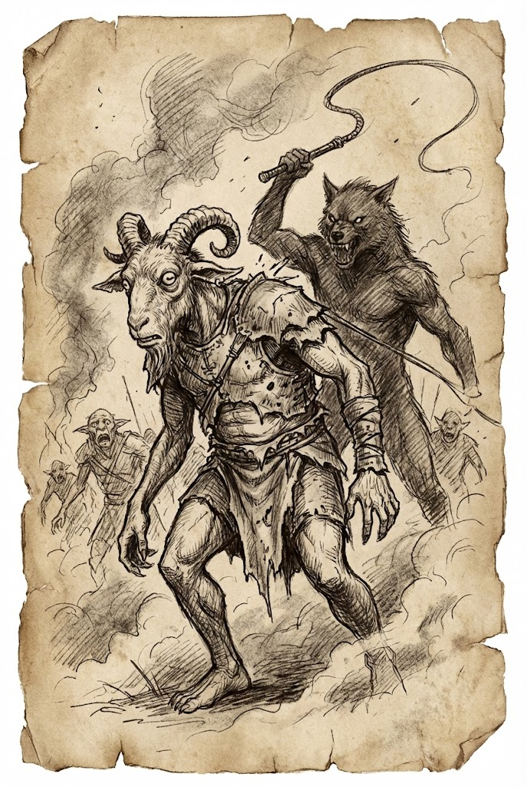

### **[Goblin](pochodzenie/goblin.md)**
Niegdyś faerie, teraz wygnane i przeklęte życiem w świecie śmiertelników. Zamieszkują śmietniska i kanały, mają dziwaczne nawyki i unikalną fizjonomię.
 **Cechy:** *Odporność na choroby, widzenie w cieniu, spryt i ukrywanie się.*
 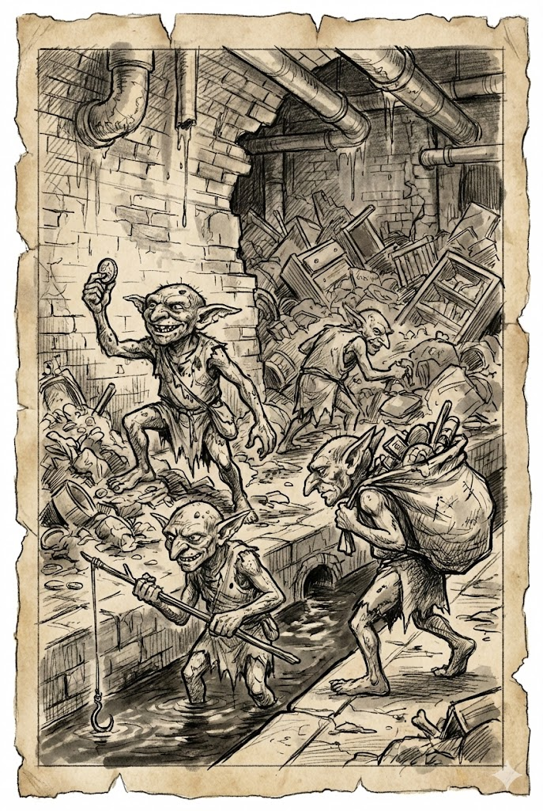

### **[Hobgoblin](pochodzenie/hobgoblin.md)**
Stworzeni z goblinów żołnierze idealni. Żyją dla wojny i służą swoim panom z fanatycznym oddaniem. W walce wpadają w przerażający szał.
 **Cechy:** *Szał bitewny, odporność na choroby, dyscyplina wojskowa.*
 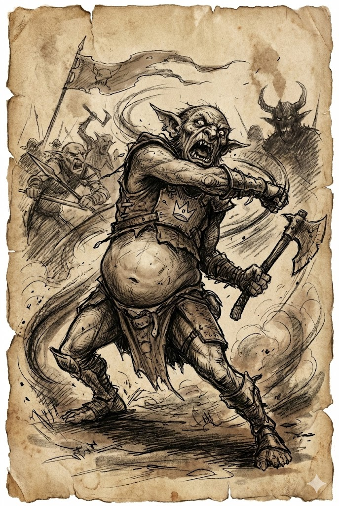

### **[Inkarnacja](pochodzenie/inkarnacja.md)**
Istoty z czystej energii stworzone przez dżinny do walki z demonami. Nie mają własnego ciała, lecz wcielają się w innych, przejmując nad nimi kontrolę w imię wyższego celu.
 **Cechy:** *Dwie formy (naturalna i wcielona), telepatia, brak zrozumienia dla moralności.*
 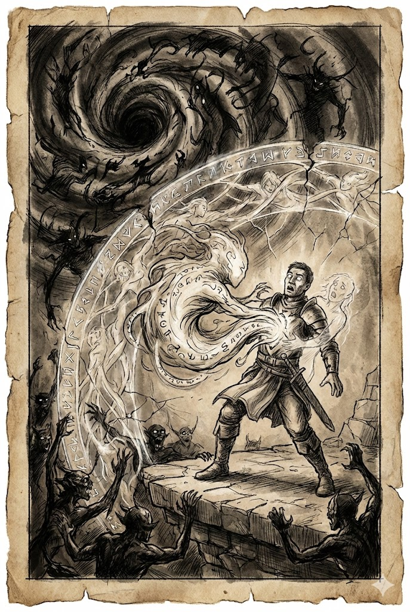

### **[Jotun](pochodzenie/jotun.md)**
Potężni potomkowie olbrzymów z Mroźnego Bezdroża. Cechują się ogromnym wzrostem, siłą i kulturą opartą na wojnie oraz przeznaczeniu (wyrd).
 **Cechy:** *Rozmiar 2, odporność na zimno, unikalna ścieżka rozwoju (zamiast nowicjusza).*
 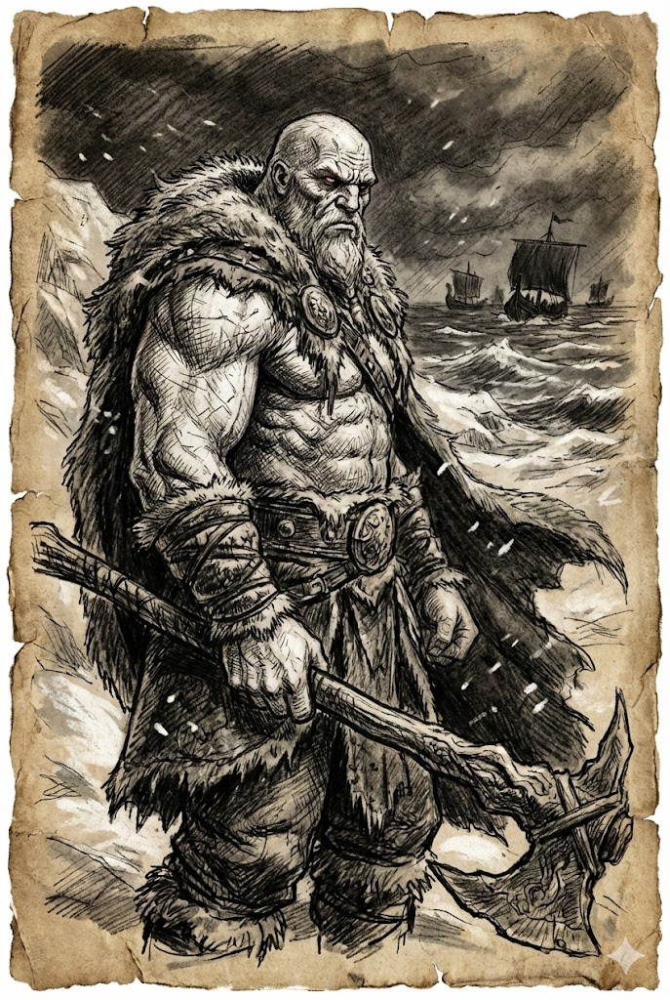

### **[Kambion](pochodzenie/kambion.md)**
Potomstwo ludzi i diabłów, naznaczone piętnem Piekła. Choć wyglądają niemal jak ludzie, walczą z mrocznymi impulsami, które popychają ich ku złu.
 **Cechy:** *Odporność na ogień, piętno ciemności, manipulacja splugawieniem.*
 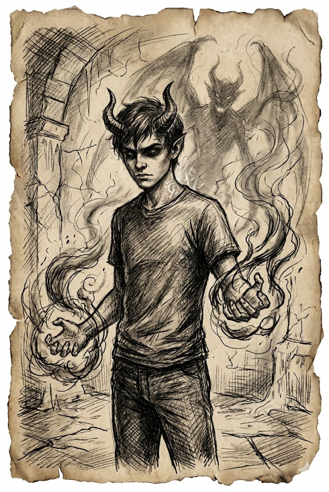

### **[Krasnolud](pochodzenie/krasnolud.md)**
Niski, krępy lud zamieszkujący podziemne miasta i kochający złoto. Są nieufni, honorowi i przywiązują ogromną wagę do swoich bród oraz walki ze znienawidzonymi wrogami.
 **Cechy:** *Widzenie w ciemności, odporność na trucizny, nienawiść do określonych wrogów.*
 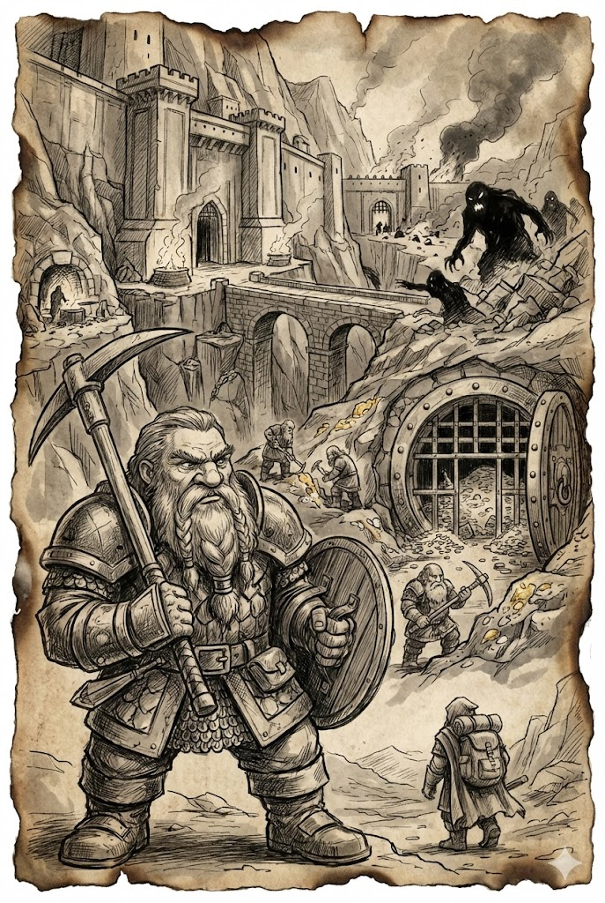

### **[Niedźwiedzidło](pochodzenie/niedzwiedzidlo.md)**
Samotni, brutalni drapieżcy łączący cechy ludzi i niedźwiedzi. Znani z porywania ofiar i kolekcjonowania makabrycznych trofeów.
 **Cechy:** *Siła, chwytanie ofiar, skradanie się.*
 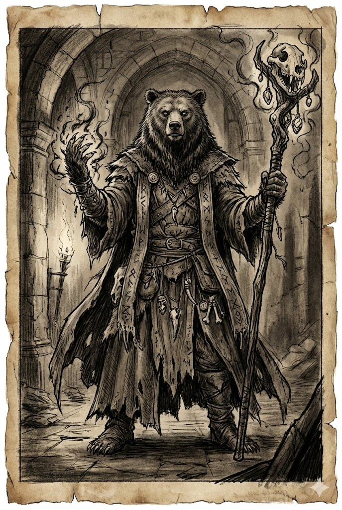

### **[Niziołek](pochodzenie/niziolek.md)**
Niewielcy, dobroduszni ludzie, którzy cenią spokój, dobre jedzenie i bezpieczeństwo domowego ogniska. Znani są ze swojego niesamowitego szczęścia, które ratuje ich z największych opresji.
 **Cechy:** *Szczęście (przerzucanie pechowych rzutów), odwaga, mały rozmiar.*
 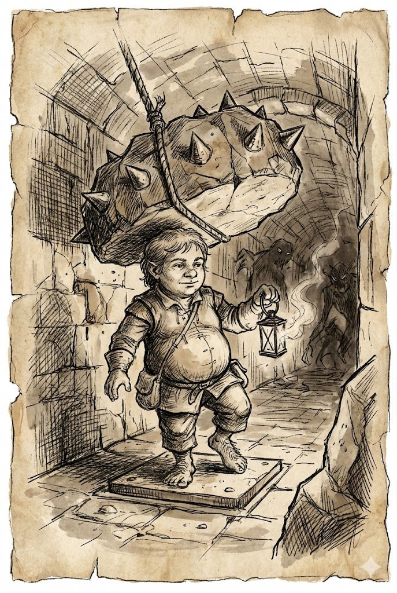

### **[Odmieniec](pochodzenie/odmieniec.md)**
Magiczne sobowtóry stworzone z błota i patyków, by zastąpić porwane przez faerie dzieci. W naturalnej formie są przerażające, ale potrafią idealnie kraść wygląd innych humanoidów.
 **Cechy:** *Zmiennokształtność (Kradzież tożsamości), wrażliwość na żelazo.*
 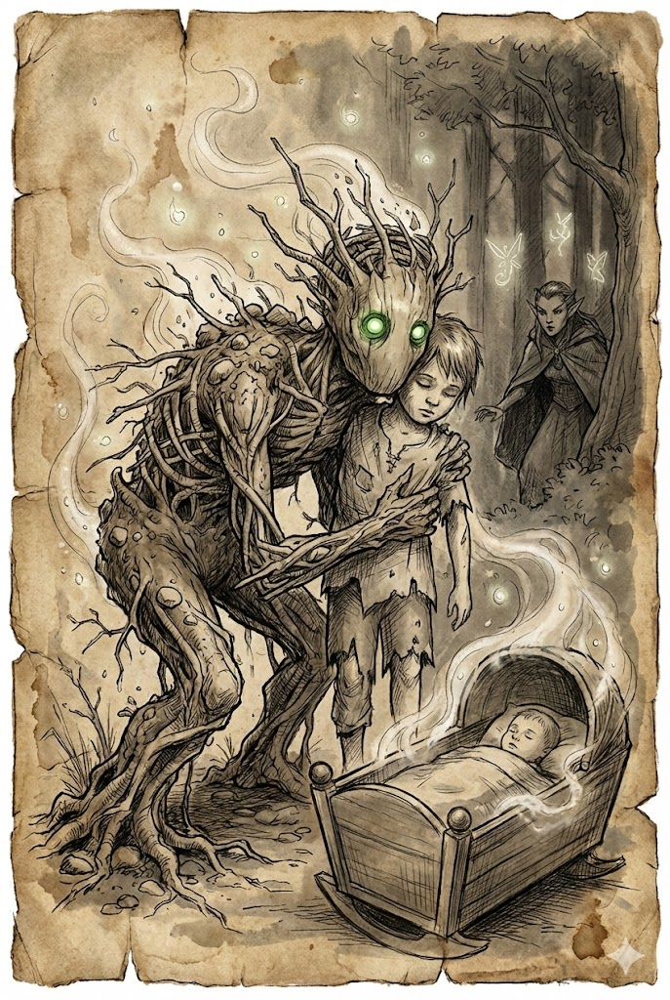

### **[Ork](pochodzenie/ork.md)**
Potężni wojownicy stworzeni przy użyciu czarnej magii i krwi olbrzymów, by służyć jako niewolnicy Imperium. Niedawno zrzucili kajdany i wzniecili brutalne powstanie.
 **Cechy:** *Ogromna siła, furia bojowa, przerażający wygląd.*
 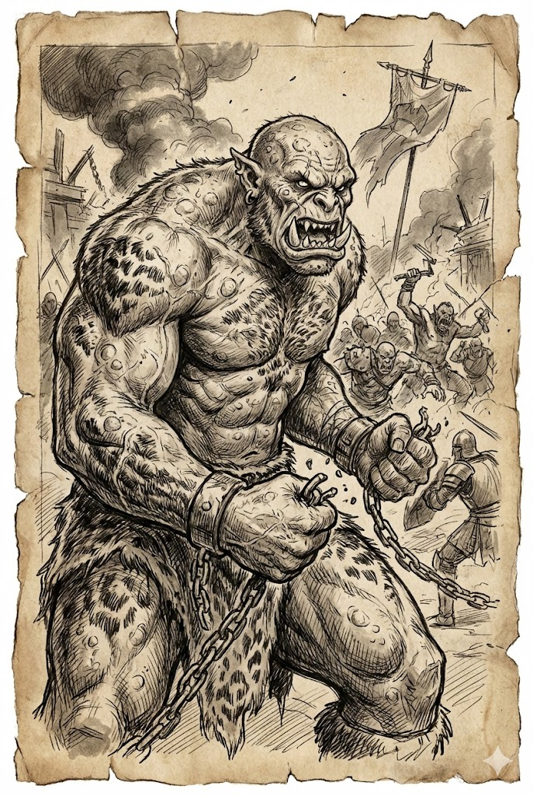

### **[Ożywieniec](pochodzenie/ozywieniec.md)**
Umarli, których przed ostatecznym końcem powstrzymała silna żądza zemsty, miłość lub niedokończone sprawy. Są trudni do zniszczenia, ale ich ciała wciąż noszą ślady śmierci.
 **Cechy:** *Odporność na choroby, powracanie do życia po śmierci, brak potrzeby snu.*
 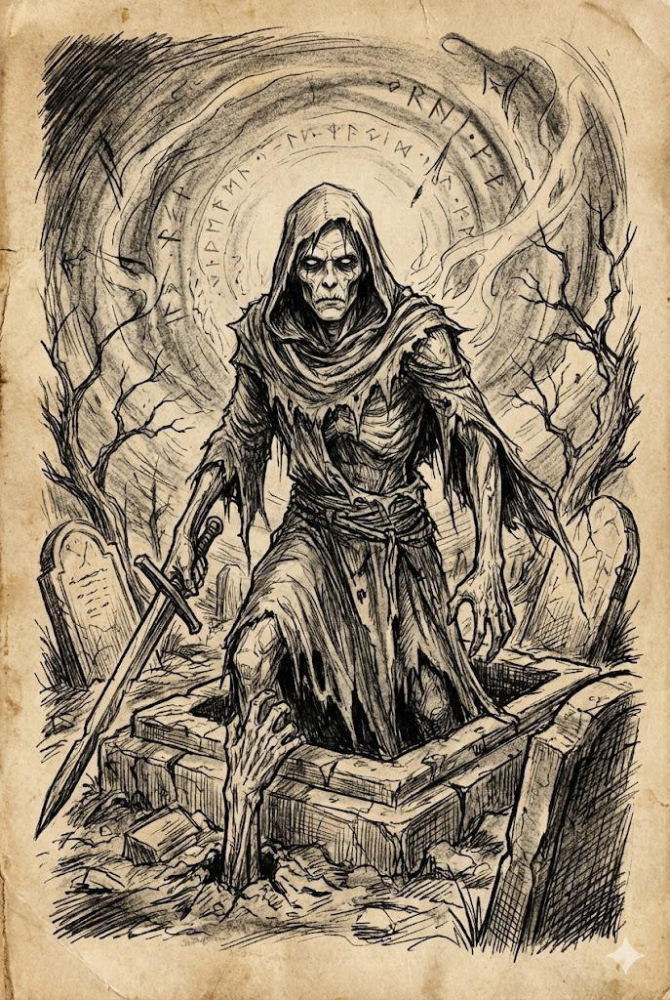

### **[Salamandra](pochodzenie/salamandra.md)**
Żywiołaki ognia uwięzione w humanoidalnych ciałach przez dżinny. Są gwałtowne, emocjonalne i emanują żarem, który może parzyć każdego, kto się do nich zbliży.
 **Cechy:** *Niewrażliwość na ogień, wybuch po śmierci, parzące ciało.*
 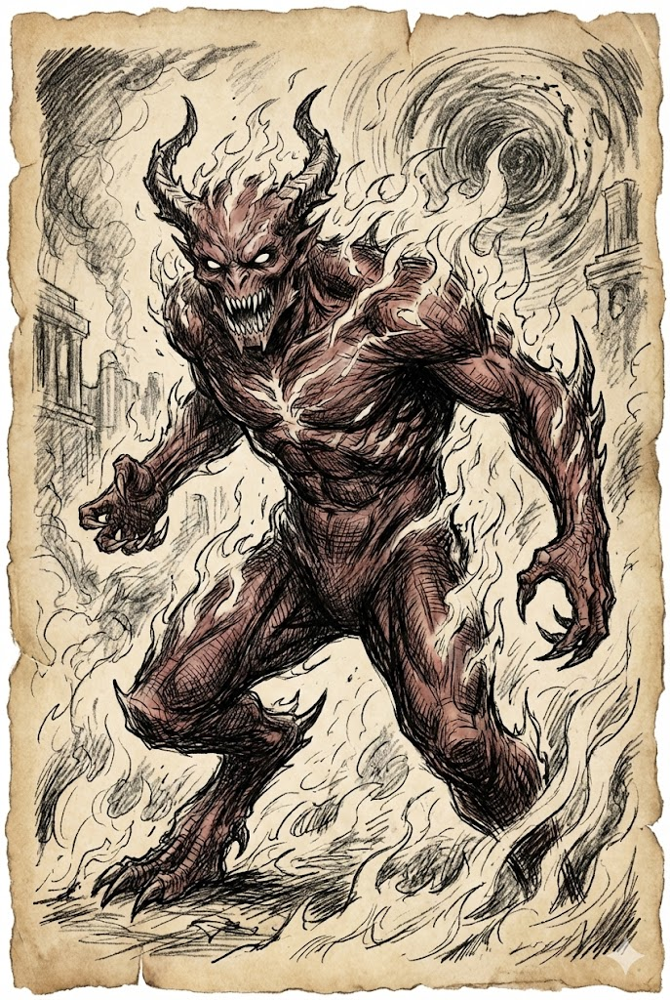

### **[Wampir](pochodzenie/wampir.md)**
Przeklęte istoty łaknące krwi, stworzone przez mroczną magię Wiedźmiego Króla. Posiadają nadludzkie zdolności, ale są niewolnikami swojego głodu i słońca.
 **Cechy:** *Picie krwi, regeneracja, wrażliwość na słońce, naturalna broń (kły).*
 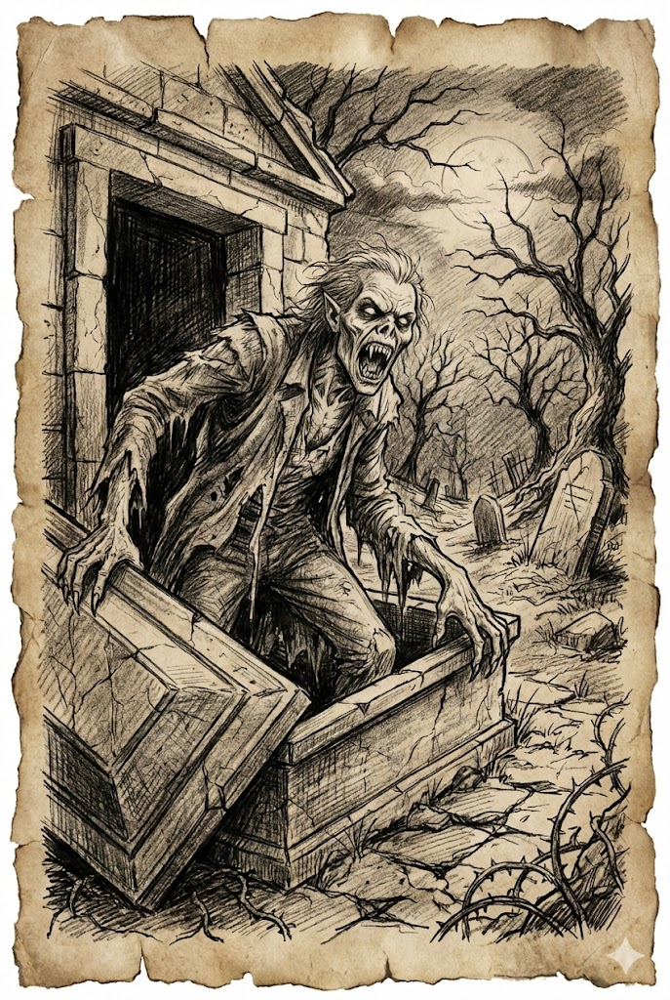

### **[Warg](pochodzenie/warg.md)**
Wilkogłowi zwierzoludzie napędzani nienawiścią i okrucieństwem. Służą jako zwiadowcy i berserkerzy, wpadając w szał po zranieniu.
 **Cechy:** *Zajadłość (kontratak po zranieniu), szybkość, agresja.*
 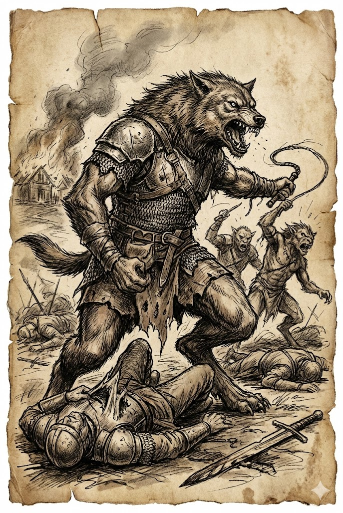