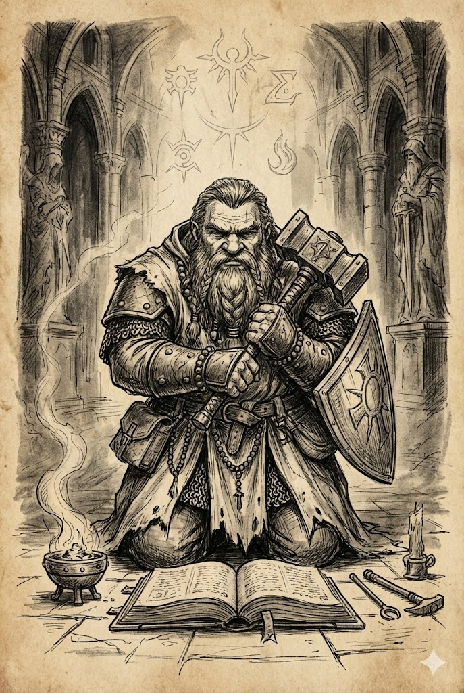

# Kleryk

Klerycy czerpią magiczną moc z zaprzysiężonej służby istocie nadprzyrodzonej. Sprawia to, że ich życia mają cel, i daje idee, za które mogą walczyć. Wiara pozwala im posługiwać się magią poprzez rytuały i modlitwę.

Poznanie tradycji magicznej to dla kleryka przeżycie religijne. W trakcie podróży natrafia on na boską obecność, doznaje objawienia, studiując święte księgi, albo ma sen, w którym zostaje wybrany na bożego sługę. To przełomowe zdarzenie stanowi pierwszy krok na tejże ścieżce i obdarowuje postać mocą pozwalającą wypełniać plany nieśmiertelnego patrona.

Religia stanowi trzon tożsamości kleryka. Kształtuje jego zachowanie, nadaje mu cel i odkrywa przed nim magiczne tradycje. Służący Nowemu Bogu korzystają z innych rodzajów magii niż ci oddani Starej Wierze.

### Szkolenie Kleryka

| k6 | Szkolenie |
|:---:|---|
| 1 | Zostałeś wybrany, by reprezentować swojego boga w świecie. |
| 2 | Zostałeś wtajemniczony przez druida lub wiedźmę. |
| 3 | Studiowałeś pisma, uczyłeś się ceremoniałów i otrzymałeś święcenia kapłańskie w jednej z instytucji religijnych. |
| 4 | Bogowie, których wyznajesz, nagrodzili cię mocą za twoją niezłomną wiarę. |
| 5 | Zawarłeś przymierze ze swoim bogiem po tym, jak ukazał ci się we śnie lub objawił w dziczy. |
| 6 | Twoje ciało zamieszkuje nadprzyrodzona istota, która poprzez ciebie dokonuje cudów. |

### Tradycje Religijne

| Religia | Powiązane Tradycje |
|---|---|
| **Kościół Nowego Boga** | Magia Niebiańska, Teurgia, Życie |
| **Krasnoludzcy przodkowie** | Magia Bitewna, Ziemia, Życie |
| **Stara Wiara** | Natura, Magia Pierwotna, Życie |
| **Wiedźmiarstwo** | Klątwy, Uroki, Życie |

---

## Kleryk, Poziom 1

**Atrybuty:** Zwiększ dowolne dwa o 1.
 **Atrybuty drugorzędne:** Zdrowie +4, Moc +1.
 **Języki i profesje:** Umiesz czytać i pisać w jednym ze znanych ci języków lub uczysz się mówić jednym dodatkowym językiem. Zyskujesz także jedną profesję religijną.

**Magia:** Poznajesz jedną z tradycji związanych ze swoją religią (patrz tabela *Tradycje religijne*). Następnie dwa razy dokonaj wyboru pomiędzy poznaniem jednej tradycji związanej z twoją religią lub nauczeniem się jednego zaklęcia ze znanej ci już tradycji.

**Wspólna odnowa:** Możesz użyć akcji, by natychmiast uleczyć tyle obrażeń, ile wynosi twoja Szybkość Zdrowienia. Następnie wybierz jedno stworzenie inne niż ty w bliskim zasięgu. Ono również leczy tyle obrażeń, ile wynosi jego Szybkość Zdrowienia. Po wykorzystaniu tego talentu musisz odbyć pełny odpoczynek, zanim będziesz mógł użyć go ponownie.

---

## Kleryk, Poziom 2

**Atrybuty drugorzędne:** Zdrowie +4.

**Magia:** Dwa razy dokonaj wyboru pomiędzy poznaniem jednej tradycji związanej z twoją religią a nauczeniem się jednego zaklęcia ze znanej ci już tradycji.

**Modlitwa:** Gdy stworzenie w twoim bliskim zasięgu wykonuje rzut na atak lub test, możesz wykorzystać reakcję, by zapewnić mu w tym rzucie 1 ułatwienie.

---

## Kleryk, Poziom 5 (Ekspert)

**Atrybuty drugorzędne:** Zdrowie +4, Moc +1.

**Magia:** Uczysz się jednego zaklęcia ze znanej już sobie tradycji.

**Boskie uderzenie:** Gdy używasz *Modlitwy*, by zapewnić stworzeniu 1 ułatwienie przy rzucie na atak, jego ataki bronią zadają dodatkowe 1k6 obrażeń.

---

## Kleryk, Poziom 8 (Mistrz)

**Atrybuty drugorzędne:** Zdrowie +4.

**Magia:** Uczysz się jednego zaklęcia ze znanej już sobie tradycji.

**Inspirująca modlitwa:** Gdy używasz *Modlitwy* na innym stworzeniu, przez 1 rundę wykonujesz rzuty na atak i testy z 1 ułatwieniem.

**Udoskonalona wspólna odnowa:** Możesz użyć *Wspólnej odnowy* dwukrotnie na każdy pełny odpoczynek.