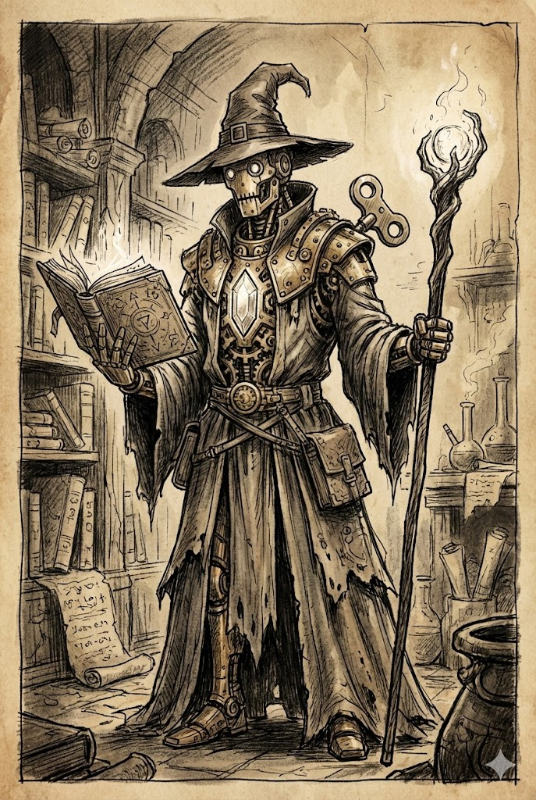

# Magik

Magicy dążą do osiągnięcia wyżyn czarodziejskiej mocy. Jeśli dotrą do końca tej podróży, wybierając ścieżki, które dopełnią posiadaną przez nich wiedzę, staną się jednymi z najpotężniejszych istot władających magią na tym świecie.

Aby zacząć naukę zaklęć, aspirujący magik musi najpierw poznać jedną z tradycji magicznych. Może to nastąpić przypadkowo, na skutek rzuconego nań czaru, poprzez natknięcie się na skąpane w nadnaturalnej energii miejsce lub odnalezienie mocy wewnątrz siebie. Może także mieć nauczyciela. Wiekowe instytucje, magowie, wiedźmy i jeszcze inni zaznajamiają obiecujących uczniów z tajnikami magicznych tradycji.

Poznawszy którąś z nich, magik uczy się najbardziej podstawowych zaklęć. Stanowi to podwaliny dalszej nauki i poznawania coraz potężniejszych czarów.

Jako że magikom wolno wybrać dowolne tradycje, daje im to bardzo różnorodne możliwości. Niektórzy skłaniają się ku magii wywołującej zniszczenie, poznając zaklęcia pozwalające kontrolować pierwotne moce wiatru, wody, ognia i ziemi. Inni preferują bardziej subtelne formy czarów, takie jak uroki, które wpływają na umysły innych, lub iluzje, które zwodzą i mamią. Kroczący tą ścieżką mogą także przywoływać potwory, by za nich walczyły, bądź dzięki sztuce inżynierii tworzyć urządzenia i mechanicznych sojuszników ze znalezionych w podróżach części.

Magia oferuje wiele możliwości, ale także kryje w sobie wiele niebezpieczeństw. Niejeden parający się czarami dał się skusić czarnej magii, zgłębiając tajniki Sztuk Zakazanych, Nekromancji czy innych, jeszcze groźniejszych tradycji. Tego typu zaklęcia prawie zawsze wiążą się ze Splugawieniem, ale ci pożądający mocy rzadko się tym przejmują.

### Szkolenie Magika

| k6 | Szkolenie |
|:---:|---|
| 1 | Odkryłeś magię, przeczytawszy księgę lub zwój z czarami. |
| 2 | Jesteś siódmym synem siódmego syna, urodziłeś się pod dziwną gwiazdą lub w twoich żyłach płynie krew potężnego użytkownika magii. |
| 3 | Zostałeś przyjęty na ucznia przez czarodzieja lub wiedźmę i nauczony podstaw magii w zamian za służbę. |
| 4 | Byłeś uczniem jednej z wielkich instytucji magicznych, być może w jednym z Dziewięciu Miast lub w Tajemnej Wieży płynącej po niebie nad Caecras, stolicą Imperium. |
| 5 | Zawarłeś pakt z istotą nie z tego świata. W zamian za poznanie tajników magii oddałeś swoją duszę, złożyłeś w ofierze cenny dar lub zaprzysiągłeś tej istocie służbę. |
| 6 | Przeżyłeś związany z magią wypadek, taki jak wypicie dziwnej mikstury lub bycie dotkniętym przez Cień Władcy Demonów. Wypadek ten obudził drzemiącą w tobie moc. |

---

## Magik, Poziom 1

**Atrybuty:** Zwiększ dwa dowolne o 1.
 **Atrybuty drugorzędne:** Zdrowie +2, Moc +1.
 **Języki i profesje:** Umiesz czytać i pisać we wszystkich znanych ci językach. Zyskujesz także wybraną przez siebie profesję naukową.

**Magia:** Poznajesz jedną tradycję. Następnie trzy razy dokonaj wyboru pomiędzy poznaniem jednej tradycji a nauczeniem się jednego zaklęcia ze znanych ci tradycji.

**Sztuczki:** Gdy poznajesz magiczną tradycję, uczysz się z niej dodatkowego zaklęcia kręgu 0.

**Wyczucie magii:** Poznajesz opisane poniżej zaklęcie *wyczucie magii*.

> **WYCZUCIE MAGII** (Magik, Zaklęcie Użytkowe 0)
>
> **Obszar:** Sfera o promieniu 5 metrów i punkcie początkowym w zajmowanej przez ciebie przestrzeni.
>
> Wyczuwasz obecne na danym obszarze efekty magiczne i ich punkty początkowe.

---

## Magik, Poziom 2

**Atrybuty drugorzędne:** Zdrowie +2.

**Magia:** Dwa razy dokonaj wyboru pomiędzy poznaniem jednej tradycji a nauczeniem się jednego zaklęcia ze znanych ci tradycji.

**Odzyskanie zaklęcia:** Możesz użyć akcji, by uleczyć tyle obrażeń, ile wynosi twoja Szybkość Zdrowienia, a także odzyskać jedno z wykorzystanych użyć znanego ci zaklęcia. Po wykorzystaniu tego talentu musisz odbyć pełny odpoczynek, zanim będziesz mógł użyć go ponownie.

---

## Magik, Poziom 5 (Ekspert)

**Atrybuty drugorzędne:** Zdrowie +2, Moc +1.

**Magia:** Poznajesz jedną tradycję lub uczysz się jednego zaklęcia ze znanych ci tradycji.

**Kontrmagia:** Gdy stworzenie, które widzisz, atakuje cię zaklęciem, możesz wykorzystać reakcję, by skontrować czar. Atakująca istota wykonuje rzut na atak z 1 utrudnieniem, a test, który ty wykonujesz, by oprzeć się efektom, zyskuje 1 ułatwienie.

---

## Magik, Poziom 8 (Mistrz)

**Atrybuty drugorzędne:** Zdrowie +2.

**Magia:** Poznajesz jedną tradycję lub uczysz się jednego zaklęcia ze znanych ci tradycji.

**Udoskonalone odzyskanie zaklęcia:** Korzystając z *Odzyskania zaklęcia*, odzyskujesz dwa użycia czaru zamiast jednego.