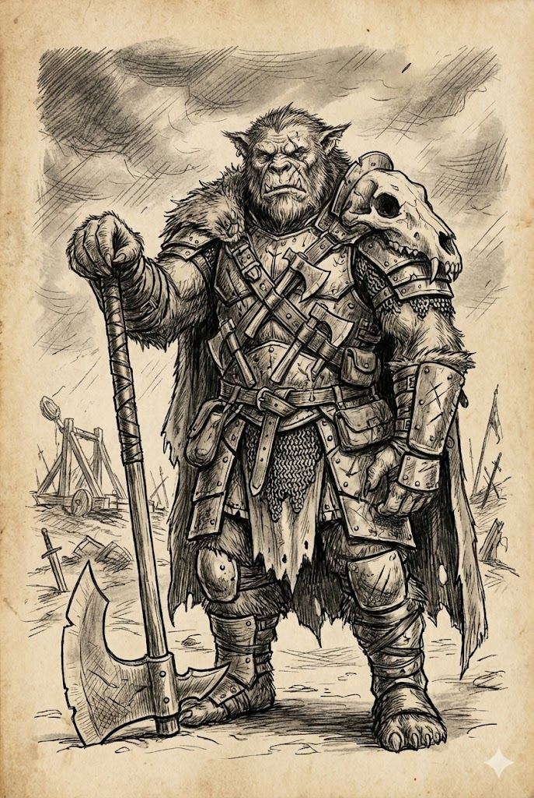

# Wojownik

Intensywny trening w użyciu broni i nauka różnych stylów walki pomagają kroczącym tą ścieżką przeżyć na polu bitwy. Zdolności wojownika opierają się na sprawności fizycznej, a także szybkości i zręczności. Po ukończeniu szkolenia jest on w stanie wprawnie walczyć niemal każdą bronią, uderzając z większą precyzją i siłą niż ktokolwiek inny.

Choć wszyscy wojownicy potrafią walczyć, odróżniają ich bronie, jakimi się posługują. Niektórzy skupiają się na walce dystansowej z użyciem łuków czy broni palnej. Inni władają mieczami i toporami, przezwyciężając wrogów czystą siłą. Jeszcze inni preferują bronie szybkie, pokonując przeciwników wprawnymi sztychami rapiera lub szabli.

Wojownicy wywodzą się z najróżniejszych środowisk. Mogą być dzikimi barbarzyńcami z pustkowi, weteranami imperialnej armii, zahartowanymi w boju najemnikami, mistrzami sztuk walki, którzy zamienili w broń własne ciała, lub kimkolwiek innym, kto zwycięża w bitwie dzięki umiejętności władania orężem.

### Szkolenie Wojownika

| k6 | Szkolenie |
|:---:|---|
| 1 | W swojej ojczyźnie walczyłeś na arenie. Każda potyczka rozwijała twoje umiejętności i doświadczenie. |
| 2 | Byłeś giermkiem służącym rycerzowi. Nauczyłeś się walczyć, jeździć na wierzchowcu, dbać o swój ekwipunek, a także postępować godnie i szlachetnie. |
| 3 | Byłeś żołnierzem, członkiem straży lub oddziałów ochotniczych. Poznałeś podstawowe techniki walki i odkryłeś w sobie talent. |
| 4 | Żyłeś z dala od cywilizacji. Trudne warunki i liczne niebezpieczeństwa nauczyły cię sztuki przetrwania. |
| 5 | Nauczyłeś się walczyć na ulicach miasta. Mogłeś być zwykłym oprychem, najemnikiem na usługach jednej z przestępczych rodzin lub ochroniarzem ważnej osobistości. |
| 6 | Byłeś uczniem mistrza sztuk walki. Być może studiowałeś w klasztorze lub szukałeś swojego nauczyciela w odległych krainach. |

---

## Wojownik, Poziom 1

**Atrybuty:** Zwiększ dwa dowolne o 1.
 **Atrybuty drugorzędne:** Zdrowie +5.
 **Języki i profesje:** Zyskujesz jedną profesję pospolitą, wojenną lub koczowniczą.

**Chwila wytchnienia:** W swojej turze możesz użyć akcji lub reakcji, by uleczyć natychmiast tyle obrażeń, ile wynosi twoja Szybkość Zdrowienia. Po wykorzystaniu tego talentu musisz odbyć pełny odpoczynek, zanim będziesz mógł użyć go ponownie.

**Wyszkolenie w walce:** Kiedy atakujesz bronią, rzut na atak wykonujesz z 1 ułatwieniem.

---

## Wojownik, Poziom 2

**Atrybuty drugorzędne:** Zdrowie +5.

**Sprawność bojowa:** Twoje ataki z użyciem broni zadają dodatkowe 1k6 obrażeń.

**Potężne uderzenie:** Gdy całkowity wynik twojego rzutu na atak wyniesie 20 lub więcej i jednocześnie przewyższy poziom trudności o co najmniej 5, atak ten zadaje dodatkowe 1k6 obrażeń.

---

## Wojownik, Poziom 5 (Ekspert)

**Atrybuty drugorzędne:** Obrona +1, Zdrowie +5.

**Doświadczenie bojowe:** Gdy wykorzystujesz akcję, by wykonać atak bronią, możesz nim zadać dodatkowe 1k6 obrażeń lub wykonać kolejny atak przeciwko innemu celowi w dowolnym momencie przed końcem swojej tury.

---

## Wojownik, Poziom 8 (Mistrz)

**Atrybuty drugorzędne:** Zdrowie +5.

**Wytrwałość:** Możesz użyć *Chwili wytchnienia* dwukrotnie na każdy pełny odpoczynek.

**Mistrzostwo bojowe:** Gdy wykorzystujesz akcję, by wykonać atak bronią, możesz nim zadać dodatkowe 1k6 obrażeń lub wykonać kolejny atak przeciwko innemu celowi w dowolnym momencie przed końcem swojej tury. Talent ten kumuluje się z *Doświadczeniem bojowym*. Każdy atak musisz wykonać przeciwko innemu celowi.