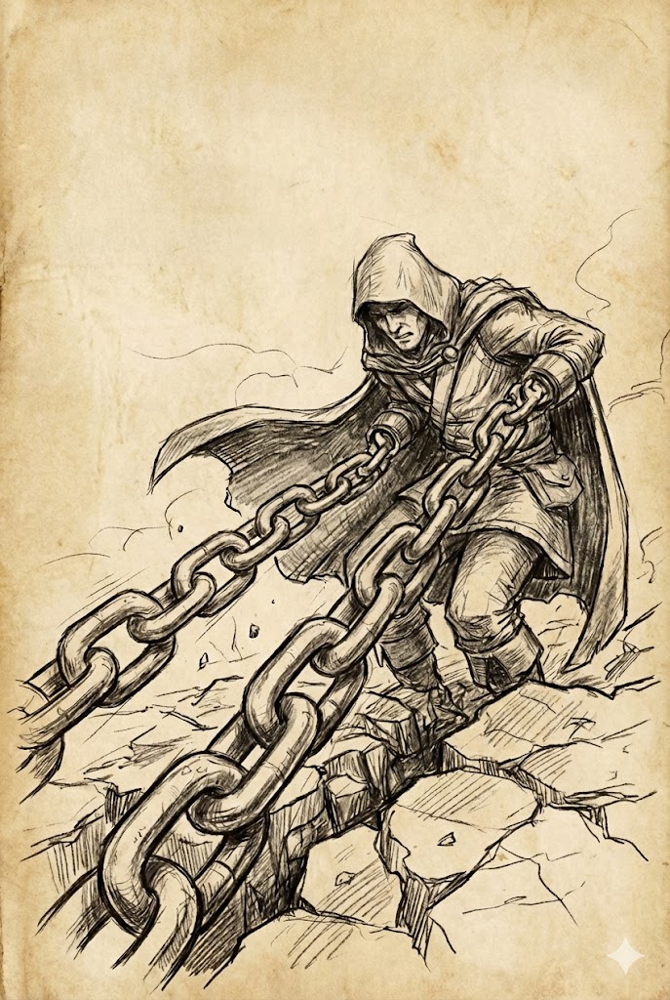

# Adamantytowe Łańcuchy
### Obraz

### Opis
!!! spell "Opis"
	**Cel:** Stworzenie na twardym podłożu w dalekim zasięgu.  
	Test Zręczności (modyfikatory za Zdrowie).  
	**Porażka**: unieruchomienie na czas koncentracji (do 1 min).  
	**Po minucie:** cel wciągnięty 3k6 km pod ziemię (uwięziony, niewidoczny dla jasnowidzenia).

### Źródło
!!! quest "Źródło"
	**Cień Władcy Demonów - Straszliwe Piękno (strona 22)**

